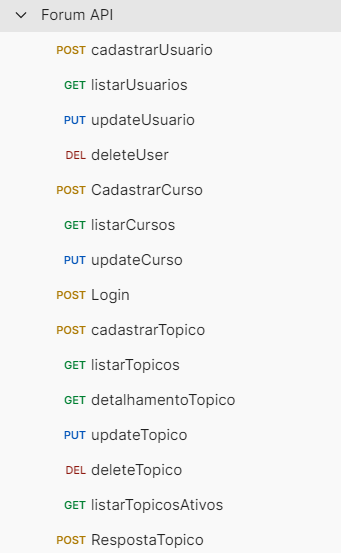
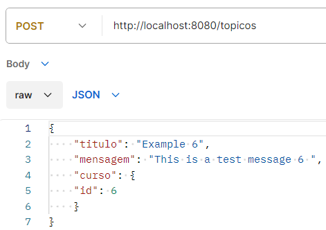

# API do Fórum -  Desafio Programa Alura Oracle One

## Visão Geral
Este aplicativo Java Spring 3 simula um fórum de mensagens onde os usuários podem criar tópicos, responder a tópicos e interagir entre si. Ele utiliza um banco de dados MySQL para armazenar informações do usuário, detalhes do curso, tópicos e respostas.

## Funcionalidades
- **Gerenciamento de Usuários**: Os usuários podem se registrar, fazer login e atualizar seus perfis.
- **Criação de Tópicos**: Os usuários podem criar novos tópicos em cursos específicos.
- **Postagem de Respostas**: Os usuários podem responder a tópicos existentes.
- **Segurança**: Utiliza o Spring Security para autenticação e autorização baseada em token JWT.

## Diagrama Banco de Dados


## Documentação
- **Swagger UI**: A documentação da API está disponível em [http://localhost:8080/swagger-ui/index.html](http://localhost:8080/swagger-ui/index.html).

## Primeiros Passos
Siga estas etapas para configurar e executar o aplicativo localmente:

1. **Clonar o Repositório**: Clone este repositório para a sua máquina local.
   ```
   https://github.com/DaviRSouza/alura-forum-api-oracle-one.git
   ```

2. **Configuração do Banco de Dados**: Configure um banco de dados MySQL e defina os detalhes de conexão nas propriedades do aplicativo.

3. **Construir e Executar**: Use o Maven para construir o aplicativo e executá-lo localmente.
   ```
   mvn spring-boot:run
   ```

4. **Acessar a API**: Uma vez que o aplicativo estiver em execução, você pode acessar a documentação da API através do Swagger UI em [http://localhost:8080/swagger-ui/index.html](http://localhost:8080/swagger-ui/index.html).

## Dependências
- Java Spring Boot 3
- MySQL
- Spring Security
- Autenticação de Token JWT

## Rotas

A seguir as rotas importantes para iniciar o projeto.

**Lista de Rotas**



**Cadastrar Usuário**

  

Importante notar que o formato do Login é sempre o email do usuário.

**Login**


O token retornado, se o usuário for válido, é usado para autenticar todas as outras rotas (use Bearer Token).


**Cadastrar Curso**


**Cadastrar Tópico**



Não é necessário enviar o "usuário" no json. O sistema busca as informações do usuário logado (informados pelo token).

**Cadastrar Resposta**


A identificação do tópico (topico_id) é informada ao final da URI.

**Outras rotas**
   ```
Listar usuários (GET) - /usuario
Update usuário (PUT) - /usuario/{idUsuario}
Delete usuário (DELETE) - /usuario/{idUsuario}
Listar cursos (GET) - /curso
Update cusos (PUT) - /curso/{idCurso}
Listar tópicos ativos (GET) - /topicos/lista
Listar todos os tópicos (GET) - /topicos/listaAdmin
Update tópico (PUT) - /topicos/{idTopico}
Delete tópico (DELETE) - /topicos/{idTopico}
Detalhamento tópico (GET) - /topicos/{idTopico}
   ```


## Contribuidores

Sinta-se à vontade para contribuir para este projeto enviando solicitações de pull ou relatando problemas.
